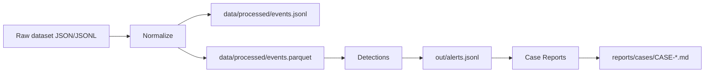

# SOC Analyst in a Box

A defensive security analytics portfolio project that mirrors SOC work end-to-end:

**logs → normalization → detections → triage writeups**

This repo focuses on *defensive* engineering & investigation. It intentionally avoids offensive tooling or exploit PoCs.

---

## What this repo contains today

✅ **End-to-end pipeline**
- Ingest Mordor-style Security-Datasets JSON/JSONL
- Normalize into a canonical schema
- Run detections → write alerts
- Render alerts into SOC-style case reports

✅ **Artifacts produced by make all**
- `data/processed/events.jsonl`
- `data/processed/events.parquet`
- `out/alerts.jsonl`
- `reports/cases/CASE-0001_*.md` (example case report)

✅ **Tests + CI**
- `pytest` unit tests
- GitHub Actions runs lint + tests

---

## Quickstart (one command)

Tip: make clean && make all rebuilds outputs from scratch (keeps .venv).
For a full environment rebuild: make reset && make all.

Expected outputs: `data/processed/events.parquet`, `out/alerts.jsonl`, `reports/cases/CASE-*.md`.

```bash
make all
```

Or step-by-step:

```bash
make setup
make test
make ingest
make detect
make report
```

## Architecture (high level)



---

## Dataset: current run (reproducible)

This repo currently uses an OTRF **Security-Datasets** “Mordor-style” dataset for Windows lateral movement:

* **Scenario:** Empire Invoke PsExec (lateral movement)
* **Notebook:** `SDWIN-190518210652`
* **Host logs zip:**

  * `datasets/atomic/windows/lateral_movement/host/empire_psexec_dcerpc_tcp_svcctl.zip`

Reproduce the exact dataset download:

```bash
cd data/raw/mordor
curl -L "https://raw.githubusercontent.com/OTRF/Security-Datasets/master/datasets/atomic/windows/lateral_movement/host/empire_psexec_dcerpc_tcp_svcctl.zip" -o dataset.zip
unzip -o dataset.zip
rm dataset.zip
cd ../../..
```

Run the pipeline:

```bash
make ingest
make detect
make report
```

Attribution: dataset provenance and scenario context are documented by the Threat Hunter Playbook / Security-Datasets notebook.

---

## Optional: sample mode (quick demo)

If you want a lightweight demo run without downloading a dataset, enable the `sample` source in `configs/sources.yaml`:

- Set:
  - `active_sources: [sample]`
- Ensure a tiny sample file exists under `data/samples/` (e.g. `data/samples/sample_events.jsonl`)

Then run:

```bash
make ingest
make detect
make report
```

Sample mode is for quick smoke runs. Switch active_sources to sample in configs/sources.yaml. For full detections, switch back to mordor.

## Example outputs (snippets)

### Alert JSON (example)

```json
{"rule_id":"suspicious_process_access","severity":"high","title":"Suspicious ProcessAccess to sensitive target process","timestamp":"...","entities":{"host":"...","user":"...","source_process":"...","target_process":"..."}}
```

### Case report

See: `reports/cases/CASE-0001_*.md`

---

## Sanity checks (recommended)

```bash
# count normalized events
wc -l data/processed/events.jsonl

# show top categories + event IDs
uv run python - << 'PY'
import pandas as pd
df = pd.read_parquet("data/processed/events.parquet")
print("categories:", df["event.category"].value_counts(dropna=False).head(10).to_dict())
print("event.action:", df["event.action"].value_counts(dropna=False).head(10).to_dict())
PY
```

---

## Note on normalization coverage

Security-Datasets/Mordor files are not perfectly uniform across scenarios.
The normalizer is intentionally conservative and maps common field paths.

Some fields may appear as `null` depending on the scenario and record type.
For this dataset, additional Sysmon-style mappings are enabled (e.g. `Hostname`, `AccountName`, `SourceImage/TargetImage`) so `host.name`, `user.name`, and `process.*` are populated where present.

---

## Detections implemented

* `suspicious_process_access`

  * Flags Sysmon ProcessAccess (Event ID 10) where a process accesses a sensitive target (e.g. `lsass.exe`)
  * Emits alert evidence with sample rows + access-mask summary (report layer)

Config: configs/detections.yaml

---

## Repository structure (high level)

* `src/socbox/ingest/` — parse + normalize to JSONL/Parquet
* `src/socbox/detect/` — rule functions + engine
* `src/socbox/report/` — render alerts into Markdown case files
* `configs/` — schema + detection configuration
* `reports/cases/` — case reports

---

## Design choices

* **Canonical schema** to keep detections dataset-agnostic
* **Explainable detections** (rule-based) over opaque scoring
* **Readable investigations** that mirror SOC triage workflow

Roadmap (optional): PowerShell keyword triage, registry/service modification, conservative beaconing patterns.